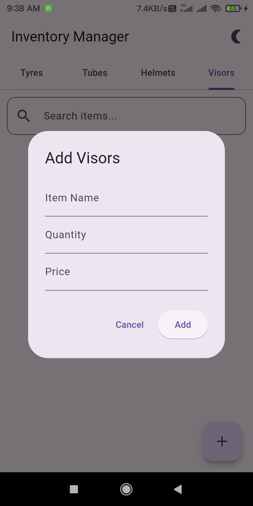
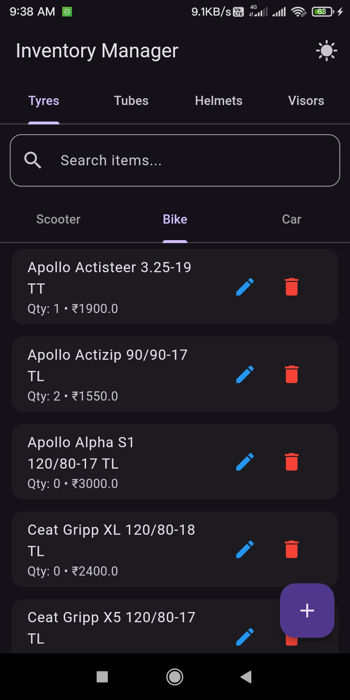
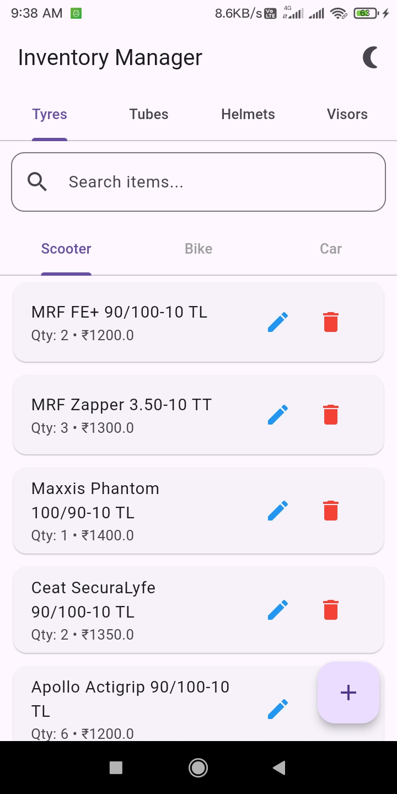
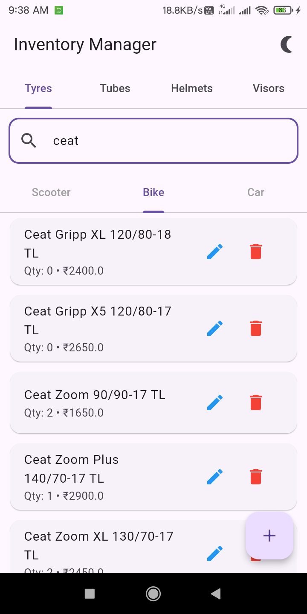
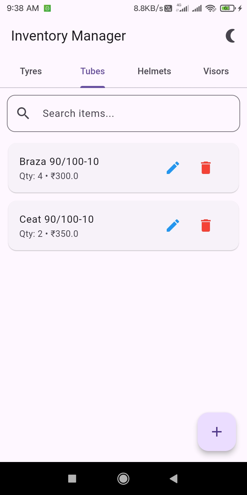
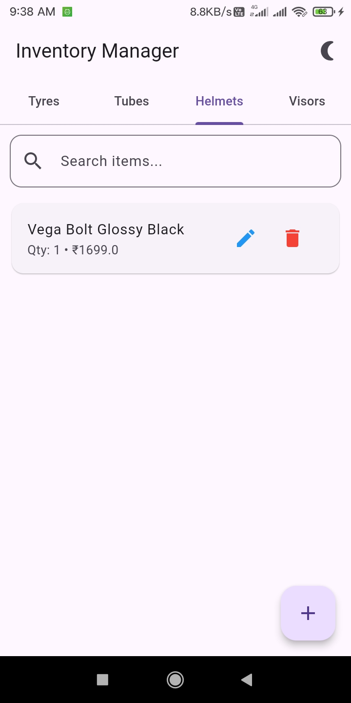
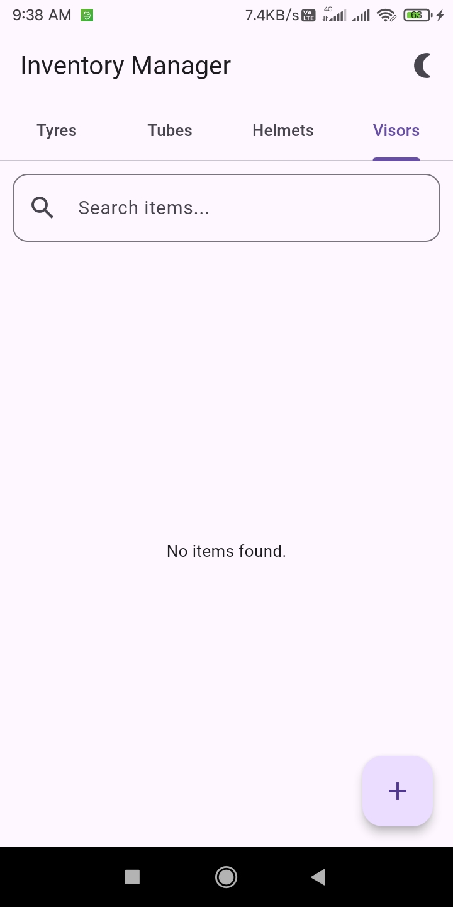

# Inventory Updater

A Flutter-based inventory management application designed to manage and organize product inventory with real-time cloud synchronization.

The application allows users to add, update, delete, search, and organize inventory items across multiple product categories.

## Features

* Add new inventory items
* Edit existing items
* Delete inventory items
* Search inventory items
* Organize products by category
* Tyre subcategories for Scooter, Bike, and Car
* Real-time inventory synchronization with Cloud Firestore
* Provider-based state management
* Light and Dark mode
* Clean and simple mobile interface

## Categories

The application supports the following inventory categories:

* Tyres
  * Scooter
  * Bike
  * Car
* Tubes
* Helmets
* Visors

## Tech Stack

* Flutter
* Dart
* Provider
* Firebase Core
* Cloud Firestore
* Material Design

## Project Structure

```text
lib/
├── db/
│   └── database_helper.dart
├── models/
│   └── item.dart
├── providers/
│   └── inventory_provider.dart
├── screens/
│   └── home_screen.dart
├── firebase_options.dart
└── main.dart
```

## Architecture

The application follows a simple structured architecture:

```text
UI
 ↓
Provider
 ↓
Cloud Firestore
```

The `InventoryProvider` manages inventory state and listens for real-time updates from Cloud Firestore.

## Inventory Operations

Users can:

* Add items with name, quantity, and price
* Edit existing inventory items
* Delete items
* Search items by name
* Filter items by category and subcategory

## Getting Started

### Prerequisites

Make sure you have the following installed:

* Flutter SDK
* Dart SDK
* Android Studio or VS Code
* A Firebase project

### Installation

Clone the repository:

```bash
git clone https://github.com/tarunrangad/inventory-updater.git
```

Navigate to the project folder:

```bash
cd inventory-updater
```

Install dependencies:

```bash
flutter pub get
```

Run the application:

```bash
flutter run
```

## Firebase Setup

Note: Firebase configuration files are not included in this repository. You must configure your own Firebase project before running the application.

This project uses Firebase Cloud Firestore for inventory data storage and real-time synchronization.

To use your own Firebase project:

1. Create a Firebase project.
2. Add your Flutter application.
3. Configure Firebase using FlutterFire CLI.
4. Enable Cloud Firestore.
5. Generate the Firebase configuration file for your project.

## Future Improvements

* Low stock alerts
* Product images
* Barcode scanning
* Sales tracking
* Customer management
* Inventory reports
* Authentication
* Role-based access
* Dashboard analytics

## Author

**Tarun Rangad**

GitHub: https://github.com/tarunrangad

## Screenshots

### Add Inventory Item



### Dark Mode



### Tyres



### Search Items



### Tubes



### Helmets



### Visors


